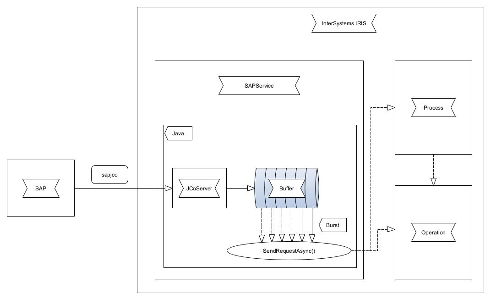

# InterSystems SAP Service

An InterSystems SAP Business Service to receive from a SAP System.

---

-   [Overview](#overview)
-   [Dependencies](#dependencies)
-   [Requirements](#requirements)
-   [Installation](#installation)
    -   [Download the latest release](#download-the-latest-release)
    -   [Setup an external language server](#setup-an-external-language-server)
    -   [Import proxy classes](#import-proxy-classes)
    -   [Setup a service](#setup-a-service)
    -   [Configure InterSystems Credentials](#configure-intersystems-credentials)
    -   [Configure the service](#configure-the-service)
-   [Lookup Table for XML Schemas](#lookup-table-for-xml-schemas)
-   [Settings](#settings)
    -   [SAP Service](#sap-service)
    -   [SAP Server Settings](#sap-server-settings)
    -   [SAP Client Settings](#sap-client-settings)
    -   [XML](#xml)
    -   [Remote Inbound Adapter Settings](#remote-inbound-adapter-settings)
-   [Bugs](#bugs)
-   [Release Notes](#release-notes)

---

## Overview

---

## Dependencies

-   [sapco.jar](https://support.sap.com/en/product/connectors/jco.html) _3.0.11 or higher_
-   intersystems-jdbc.jar _3.2.0 or older_
-   intersystems-utils.jar _3.2.0 or older_

> **Note:** The _intersystems-jdbc.jar_ and _intersystems-utils.jar_ are included in the InterSystems IRIS installation. You can find them in the `~/dev/java` folder.

---

## Requirements

-   [InterSystems IRIS](https://www.intersystems.com/products/intersystems-iris/) _2021.1 or newer_ or [InterSystems IRIS for Health](https://www.intersystems.com/products/intersystems-iris-for-health/) _2021.1 or newer_
-   An interoperability enabled namespace

---

## Installation

### Download the latest release

1. Download the _intersystems-sap-service-\*.jar_ file from the [latest release](https://github.com/phil1436/intersystems-sap-service/releases/latest)
2. Save the file to a folder visible to the InterSystems IRIS instance

### Setup an external language server

1. In the Management Portal navigate to _System Administration > Configuration > Connectivity > External Language Servers_
2. Click on _Create External Language Server_ or configure the standard _%Java Server_ server by double-clicking on the server name
3. Select _Java_ as the _Server Type_
4. Select the _sapjco.jar_ in the _Class Path_ field. **The _sapjco.dll_ must be in the same folder as the _sapjco.jar_ file**
5. Select the jdk **1.8** folder in the _Java Home Directory_ field
6. Click on _Save_
7. Click on _Start_ next to the server you just created

> **Note:** This step is namespace independent. You can use the same server in multiple namespaces.

### Import proxy classes

1. In the Management Portal navigate to _System Explorer > Classes_
2. On the left side of the screen select the namespace where you want to use the service
3. Click on _Import_
4. Select _Directory_ under _Import from File or a Directory_
5. Select the _[cls](cls)_ folder from the downloaded repository
6. Click on _Import_

### Setup a service

1. In the Management Portal navigate to _Interoperability > Configure > Production_
2. Create a new production or open an existing one
3. Click on the _+_ button next to the _Services_
4. In the field _Service Class_ select the class _com.intersystems.dach.ens.sap.PassthroughService_
5. Click on _OK_

### Configure InterSystems Credentials

1. In the Management Portal navigate to _Interoperability > Configure > Credentials_
2. Add an _ID_ of your choice
3. Select the _User Name_
4. Select the _Password_
5. Click on _Save_ or _New_

### Configure the service

2. Select the just created service
3. Select the _Settings_ tab on the right side of the screen
4. Under _Remote Inbound Adapter Settings: External Language Server Name_ configure the name of the external language server you created in the [Setup an external language server](#setup-an-external-language-server) step
5. Under _Remote Inbound Adapter Settings: Gateway Extra CLASSPATH_ configure the path to the _intersystems-sap-service-\*.jar_ file
6. Configure all SAP connection parameters
7. Under _Basic Settings: Target Config Names_ configure the name of the process or the operation you want to call
8. Click on _Apply_
9. Start the service

> **Tip:** You can see if the service could be successfully started in the _Log_ tab of the service.

---

## Lookup Table for XML Schemas

You can use a lookup table to map the XML schema to the SAP function module. Navigate to _Interoperability > Configure > Data Lookup Tables_ and create a new lookup table. The key is the name of the SAP function module and the value is the XML schema with the category, sperated by an double point e.g. `My_Category:My_XML_Schema`.

---

## Settings

### SAP Service

-   `UseJSON` _boolean_ - If enabled, the service will convert the SAP data to JSON. _(default: false)_
-   `ConfirmationTimeoutSec` _integer, required_ - The time in seconds the service will wait for a confirmation for a message to be processed. _(default: 10)_
-   `EnableTesting` _boolean_ - If enabled, the service will start with some test data and will log more to the log. _(default: false)_
-   `QueueWarningThreshold` _integer, required_ - The maximum number of messages that can be queued. _(default: 100)_

### SAP Server Settings

-   `GatewayHost` _string, required_ - The host address of the SAP Gateway
-   `GatewayService` _string, required_ - The service name of the SAP Gateway. Usually `sapgwNN` whereas NN is the instance number.
-   `ProgrammID` _string, required_ - The Program ID of this service to identify the connection.
-   `ConnectionCount` _integer, required_ - The number of connections to the SAP Gateway.
-   `Repository` _string, required_ - The name of the SAP Repository.

### SAP Client Settings

-   `HostAddress` _string, required_ - The host address of the SAP System.
-   `ClientID` _string, required_ - The Client ID of your mandant.
-   `SystemNumber` _string, required_ - The System Number of the SAP System.
-   `SAPLanguage` _string, required_ - The language of the SAP System.
-   `SAPCredentials` _string, required_ - The ID of the credentials to use for the SAP System you configured in the [Configure InterSystems Credentials](#configure-intersystems-credentials) step.

### XML

-   `ImportXMLSchemas` _boolean_ - If enabled, the service will try to import the XML Schemas from the SAP System. _(default: false)_
-   `XMLSchemaPath` _string_ - The path to the folder where the XML Schemas should be stored. If the folder does not exist, it will be created.
-   `LookUpTableName` _string_ - The name of the table you configured in [Lookup Table for XML Schemas](#lookup-table-for-xml-schemas). If left empty no lookup table will be used.

<!-- ### Logging

-   `LogFilePath` _string_ - An absolute Path to a file where the service will log the messages. The file must be already created and writeable, the service will **not** create the file. If no or an invalid path is set, the service will not log the messages.
-   `ClearLogOnRestart` _boolean_ - If set to true, the log file will be cleared when the service is restarted. _(default: false)_ -->

### Remote Inbound Adapter Settings

-   `External Language Server Name` _string, required_ - The name of the external language server to connect to.
-   `Gateway Extra CLASSPATH` _string, required_ - The path to the _intersystems-sap-service-\*.jar_ file.

<!-- -   `Gateway Host` _string_ - The host address of the external language server to connect to. If you use a external language server this can be left empty.
-   `Gateway Port` _integer_ - The port of the external language server to connect to. If you use a external language server this can be left empty. -->

---

## Bugs

-   _no known bugs_

---

## [Release Notes](https://github.com/phil1436/intersystems-sap-service/blob/master/CHANGELOG.md)

### [v1.0.0](https://github.com/phil1436/intersystems-sap-service/tree/1.0.0)

-   _Initial release_

---

by [Andreas S.](https://github.com/a-schuetz) and [Philipp B.](https://github.com/phil1436)
